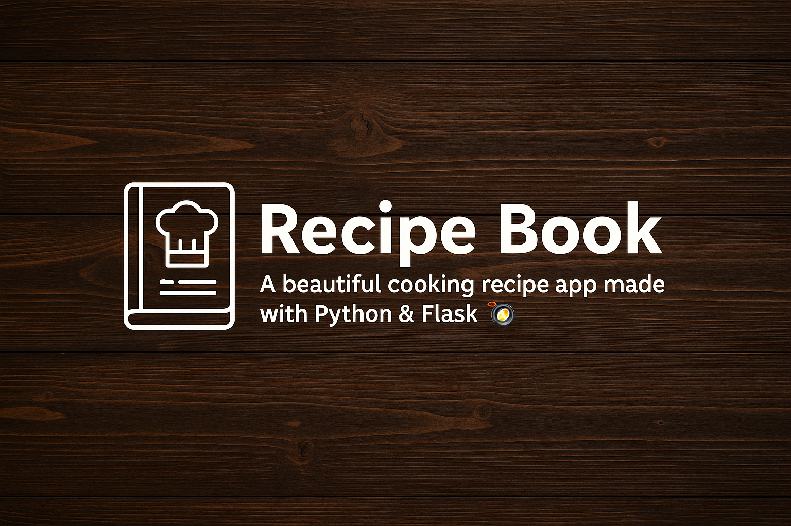

<p align="center">
  
</p>

```markdown
# 🧾 Recipe Book - Flask App
A beginner-friendly web app built with Flask that lets users **add and view cooking recipes**.

## ✨ Features


- 📝 Add new recipes (title, ingredients, steps)
- 📖 View recipes as neat cards
- ✏️ Edit existing recipes
- 🗑️ Delete recipes with confirmation
- 🔍 Search recipes by title
- 🔐 Simple login system (enter any username)
- 📱 Responsive design with clean layout
- 🖼️ Background image and icons for better UX

## 📁 Folder Structure
```
recipe-book-flask-app/
├── app.py
├── templates/
│ ├── index.html
│ ├── add.html
│ ├── edit.html
│ └── login.html
├── static/
│ └── style.css
├── requirements.txt
└── README.md
```


## 🚀 Run Locally

```bash
python app.py
```

Open in browser: [http://127.0.0.1:5000](http://127.0.0.1:5000)

Made with 💚 by [Rumaisa Islam](https://github.com/Rumaisas-islam)
